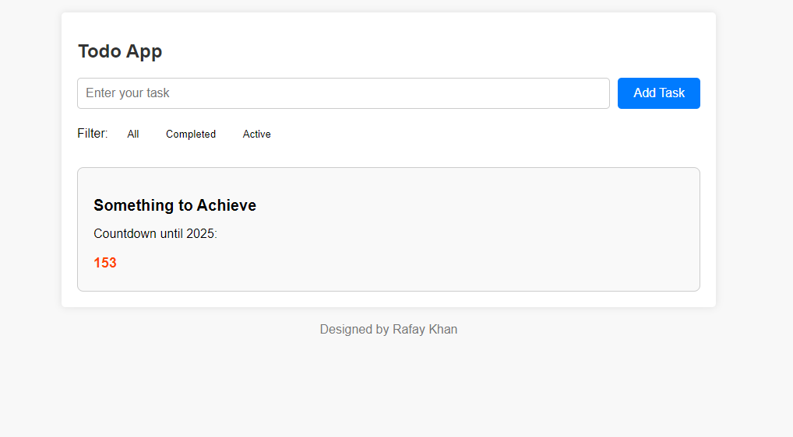

# Todo App

This is a simple Todo App created by ME Rafay.

## Features
- Add tasks to your todo list
- Mark tasks as completed
- Filter tasks by status (all, completed, active)
- Wishlist with countdown timer

## Usage
- Enter a task in the input field and click "Add Task" to add it to the list.
- Click the checkbox next to a task to mark it as completed.
- Use the filter buttons to show all tasks, completed tasks, or active tasks.
- The wishlist box displays the number of days remaining until 2025.

## Developer
- **Name:** Rafay Khan
- **Email:** rafaykhan2k19@gmail.com

