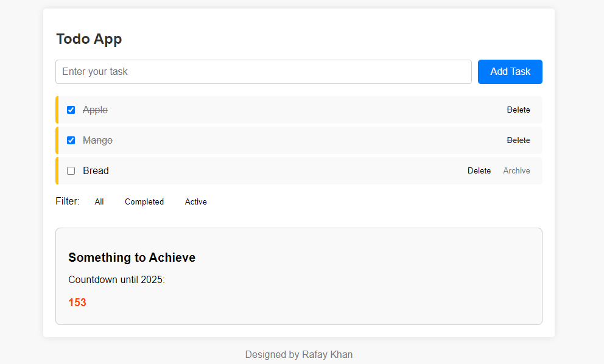

# Todo App 📝

This is a simple Todo App.

## Features ✨
- ➕ Add tasks to your todo list
- ✅ Mark tasks as completed
- 🔍 Filter tasks by status (all, completed, active)
- 🕒 Wishlist with countdown timer

## Usage 🚀
1. Enter a task in the input field and click "Add Task" to add it to the list.
2. Click the checkbox next to a task to mark it as completed.
3. Use the filter buttons to show all tasks, completed tasks, or active tasks.
4. The wishlist box displays the number of days remaining until 2025.

## Developer 👨‍💻
- **Name:** Rafay Khan
- **Email:** rafaykhan2k19@gmail.com
